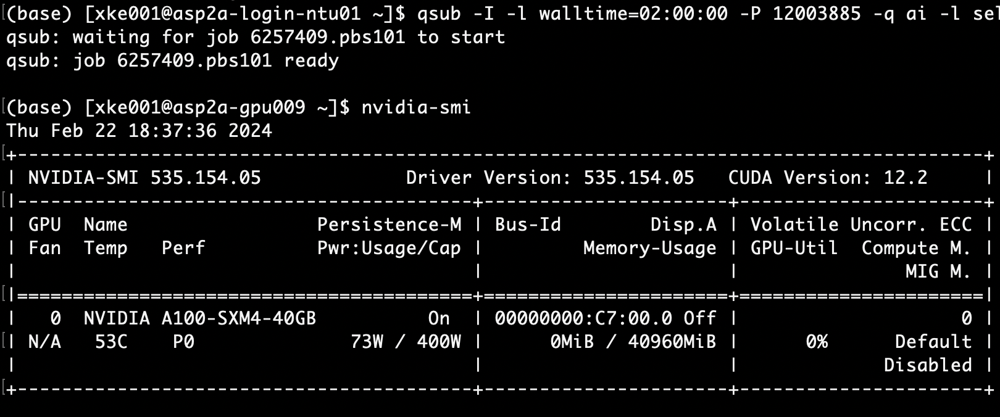

# NCSS Server
## Basic
##### Conncet
Copy your private key from NSCC website, then save it under `.ssh/` folder, named `ida_rsa`. *(Or other name if you alr have a private key named this)*
```bash
# set security permission to your private key
chmod 600 your/path/to/.ssh/id_rsa
# connect
ssh usrname@aspire2antu.nscc.sg -i <path to private key> 
```
###### ssh Config(optional)
In your `.ssh/` folder, find/create file named `config`, then add these:
```shell
Host nscc # any name you want
  HostName aspire2antu.nscc.sg
  User yourusrname
  IdentityFile ~/.ssh/id_rsa # path to your private key
```
then you can connect using:
```shell
ssh nscc
```
##### Check Usage & Project infos
```shell
myquota # storage usage of home/personal directory
myquota -p <project_id> # storage of the project
myusage # personal usage
myprojects # project infos
```

##### Modules
```shell
module list # current loaded models
module load craype-accel-nvidia80 # load cuda enviorment (or other module)
module load python/3.10.9 # load python 3.10.9

module avail #check all available modules
module avail 'name' # search available 'name' modules
module -l avail 2>&1 | egrep 'name' # search available module containing 'name'

module swap PrgEnv-cray PrgEnv-intel # module swap for prefix PrgEnv
```

##### File System
| File System | Mount point                | Total Capacity | Quota | Data Retention |
|-------------|----------------------------|----------------|------------------------|-----------------------|
| Lustre      | `/scratch`                 | 10 PB          | 100TB                  | Purge                 |
| GPFS        | `/home/users`              | -              | 50GB                   | Yes                   |
| GPFS        | `/home/project`            | 15PB           | Based on project       | Yes                   |
| Local       | `/raid/<jobid>.pbs101` | 12/14TB        | Auto-created           | Auto-removed          |

`/raid/<jobid>.pbs101` for training script
`/home/project/12003885` is where our env and dataset

## Env Setup
##### Install miniconda
```shell
source /home/users/ntu/'your usr name'/.bashrc
# source /home/users/ntu/xke001/.bashrc

wget https://repo.anaconda.com/miniconda/Miniconda3-latest-Linux-x86_64.sh
bash Miniconda3-latest-Linux-x86_64.sh -b -p /home/project/12003885/miniconda3
```
##### Initallization
User guide suggest not do conda init, which may casue login slow and double env when `module load miniconda3`(but actually no available module with conda)
```shell
<your folder>/miniconda3/bin/conda init
```

##### Env create
You can upload your `environment.yml` file, then
```shell
<your folder>/miniconda3/bin/conda env create -f <your folder>/environment.yml

conda activate 'env_name' # env name is in `environment.yml`
```
Or do `pip install` and any other package set up method.

##### Load module
```shell
module load git
module load cuda
module load gcc
```
## Submit Interactive Job

| Command           | Comments                                        |
|-------------------|-------------------------------------------------|
| `qsub <jobname.sh>` | To submit a job to the cluster.                  |
| `qstat`             | To print running/pending job states on the screen. |
| `qdel <jobid>`      | To remove a job.                                 |
| `qstat -x`          | To display status information for finished and moved jobs. |

*Source: Dr. Satoshi's cheat sheet*
##### Submit interactive job
Interactive means having a interface of cmd terminal where you can input command you what and also see output.
```shell
export PROJECT_ID=<your project id>
qsub -I -l walltime=48:00:00 -P 12003885 -q ai -l select=1:ncpus=128:ngpus=1:mem=512G
``` 
- `walltime=48:00:00` means max operating time, after this span will terminate the submitted job
- `-P 12003885` means sysmex project id
- `-q ai` means using queue of ai, this one is compulsory
- `select=1:ncpus=128:ngpus=1:mem=512G` 1 node, 128 CPU core, 1 GPU core, 512 memory as resources

Then, it will out put job id like this:

Now 6257409 is your job id, and server auto generated /raid/pbs.6257409.pbs101 folder - **fast I/O**

*note: seems we can only use 1 GPU, `ngpus`>1 will make job always queuing*


# Editor
There is no any GUI (graphic user interface) on NSCC server, so you can't install IDE. The only way to modify code is using the most tradional method, which is text editor.
## Vim Editor
##### Lauch vi:
```shell
$ vi <filename> #or vim <filename>
```
##### Insert mode, press:
1. **a** - append
2. **i** - insert
3. **o** - new line

##### Command mode:
1. quit and save modification
```shell
:wq # write and quit
```
2. quit without saving
```shell
:q!
```
##### Swich mode:
- press **Esc**
##### Comment Block Code
###### Decomment
Put your cursor on the first `#` character, press `Ctrl``V` (or `Ctrl``Q` for gVim), and go down until the last commented line and press `x`, that will delete all the `#` characters vertically.
###### Comment
For commenting a block of text is almost the same: 

First, go to the first line you want to comment, press `Ctrl V`, and select until the last line. 

Second, press `Shift I # Esc` (then give it a second), and it will insert a `#` character on all selected lines. 
For the stripped-down version of vim shipped with debian/ubuntu by default, type `: s/^/#` in the second step instead.

## Nano Editor
---Need Update---